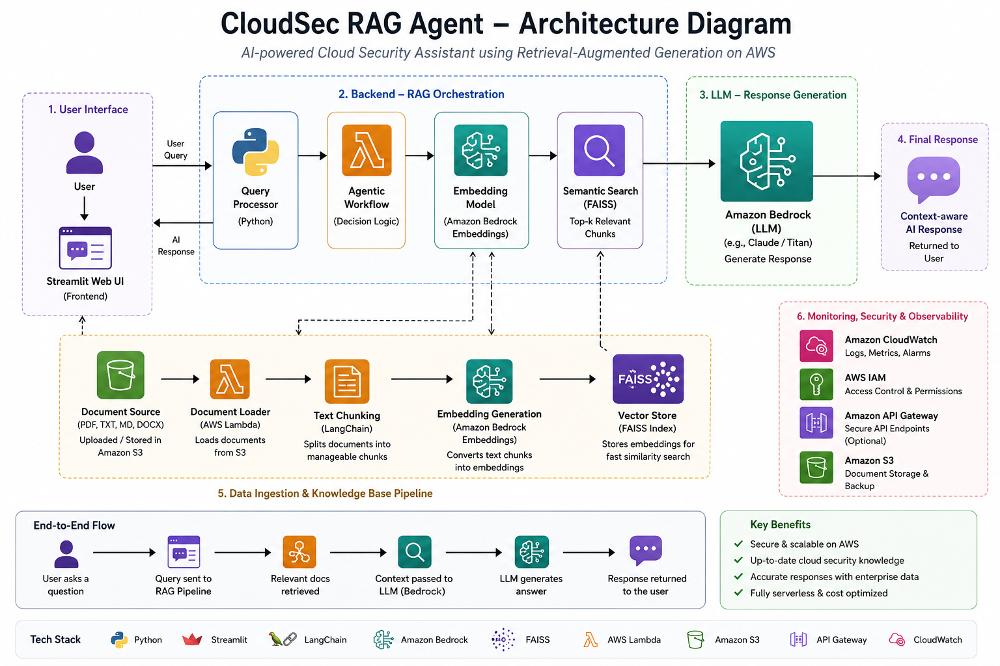

# Agentic AI Workflow with Retrieval-Augmented Generation on AWS

## Architecture

## Project Overview

This project is an AWS-powered Agentic AI assistant that uses Retrieval-Augmented Generation to answer questions from cloud security and AWS documentation.

The system retrieves relevant information from a document knowledge base and uses an AI model to generate accurate, context-aware responses.

## Key Features

- Document ingestion pipeline
- Text chunking and embedding generation
- Vector-based semantic search
- RAG-based question answering
- Agentic workflow for deciding retrieval and response steps
- AWS-based deployment using S3, Lambda, API Gateway, Bedrock, and CloudWatch

## Use Case

Cloud Security Knowledge Assistant for answering questions related to AWS security best practices, IAM, S3 security, incident response, and cloud compliance.

## Planned AWS Services

- Amazon S3
- AWS Lambda
- Amazon API Gateway
- Amazon Bedrock
- Amazon CloudWatch
- Amazon OpenSearch Serverless or local FAISS

## Status

Project execution started.
